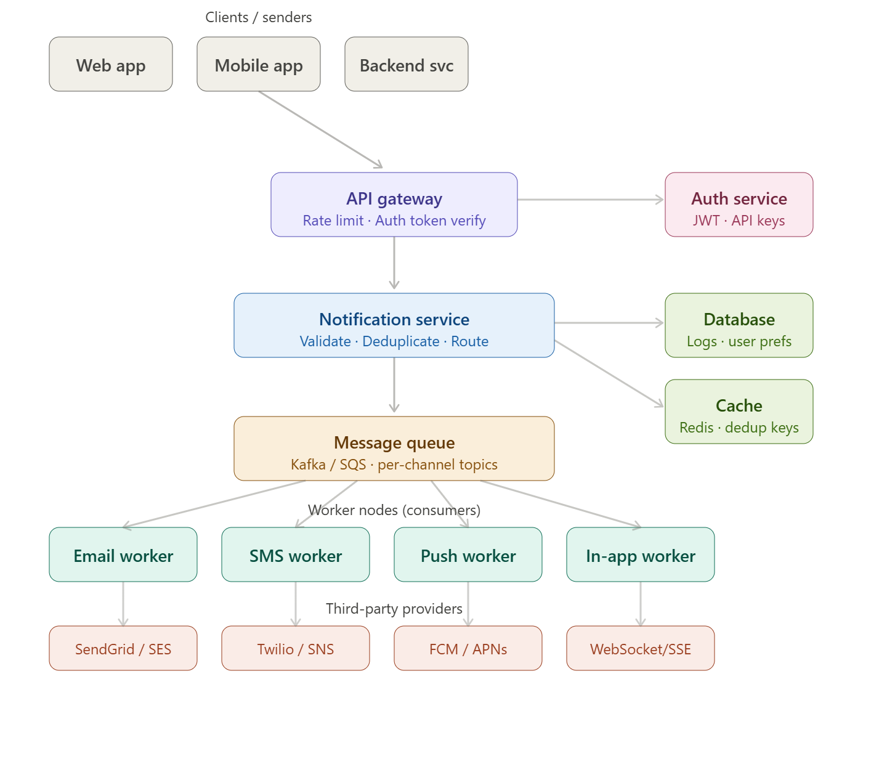

1. High-level design
A notification system has five main layers:
Ingestion — clients (web, mobile, other backend services) send a POST /notifications request to the API gateway, which enforces rate limits and validates the auth token before passing the request downstream.
Routing — the Notification Service is the brain. It validates the payload, looks up user preferences (do they want email? SMS?), deduplicates (has this notification already been sent?), and enqueues one message per channel onto the Message Queue.
Queue — Kafka or SQS holds per-channel topics (notifications.email, notifications.sms, etc.). This decouples ingestion from delivery, absorbs traffic spikes, and gives you retry semantics for free.
Workers — consumer groups pull from each topic and call the right third-party provider: SendGrid/SES for email, Twilio for SMS, FCM/APNs for push, WebSocket/SSE for in-app.
Storage — Postgres or DynamoDB stores notification logs and user preferences. Redis is the cache layer for dedup keys and rate-limit counters.